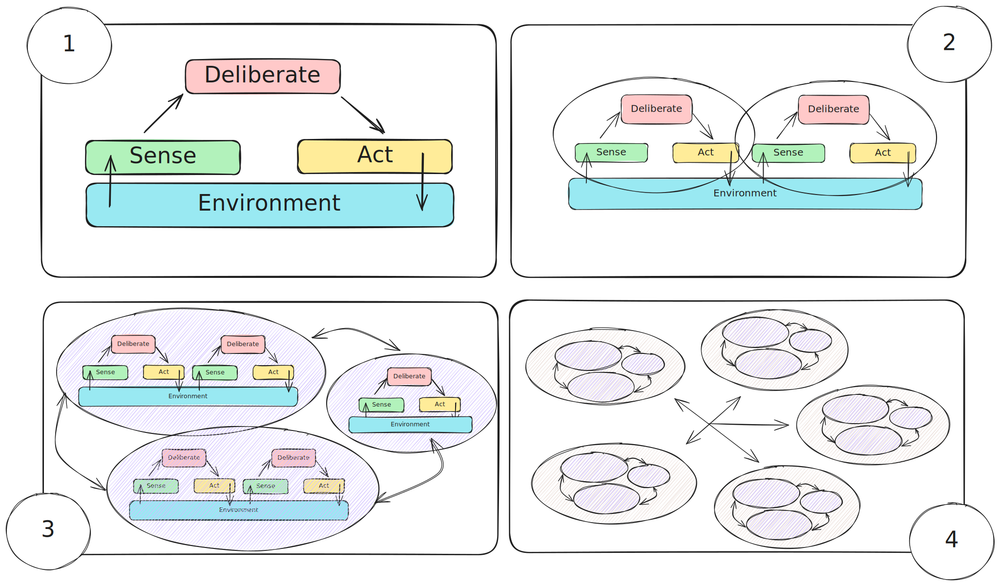

+++
title = "Cognitive Agents in the Field"
outputs = ["Reveal"]
+++

## Cognitive Agents in the Field:
### an Hybrid Approach Between Agent-Oriented and Aggregate Computation

 

*Martina Baiardi*
 
University of Bologna, Italy

---

## Context: Modelling complex systems

* Modelling play a crucial role in computer science research
    * they *bridge* the *abstraction gap* between high-level conceptual understanding and *low-level* implementation *details*
        * enabling researchers to focus only on essential system properties; 
    * they enable *reproducibility* in research by providing *precise specifications* that can be validated and compared 
    * they serve as *development guides* that inform architectural decisions and implementation strategies, 
        * *reducing* the likelihood of *design errors* 
    * they provide the *flexibility* needed to adapt to changing requirements

---



## Two approaches in the SASO community

{}
{}

### *single-agent perspective* 
Focuses on modelling individial entities behavior
  * *Mape-K*, *Procedural Reasoning System*, ...

{}
{}

### *collective perspective*
Focuses on the emergent behavior and properties that arises from the interaction of *several* entities.
  * *Aggregate Programming Paradigm*

{}
{}

---

{}
{}

## Contribution

*Why not leverage the strengts of both paradigms within a single system?*

We propose the creation of a software framework that allows to perform together:
1. *Local Cognitive Decision-Making*
2. *Collective-Oriented Task Delegation*
3. *Bidirectional communication flow* between the two layers

{}
{}

{}
{}

---

## Methodology

{}
{}

*How it is possible to achieve this?* Leveraging existing tools

* JaKta¹ as a framework for modeling cognitive agents (following the Beliefs-Desires-Intentions architecture)
* Collektive² as framework for Aggregate Programming

{}
{}

Both technologies are: 
* Built on top of Kotlin 
* Distributed as open-source libraries
* Provide an internal Domain-Specific Language

{}
{}

 

*The expected result is a unified framework for modelling cognitive agents   that can invoke collective computation as a natural extension of agents capabilities.*

 
<small>
¹ https://jakta-bdi.github.io/  
² https://collektive.github.io/

</small>

---



## Main challenge: domain integration

### *Logic-based nature of BDI reasoning* vs *Field-based Aggregated computations*

 ---

 ## Research Plan

 * *Phase 1*: separation of the BDI reasoning engine and logic constructs.
 * *Phase 2*: Domain integration between the existing libraries 
     * BDI reasoning over field-based data structures
 * *Phase 3*: Validation of the framework through simulation of real-world deployments,  to test scalability, robustness, and efficiency.

